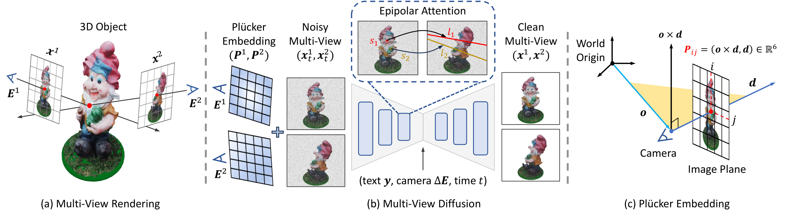

SPAD : Spatially Aware Multiview Diffusers
===================================================
<h4>
Yash Kant, Ziyi Wu, Michael Vasilkovsky, Gordon Qian, Jian Ren, Riza Alp Guler, Bernard Ghanem, Sergey Tulyakov*, Igor Gilitschenski*, Aliaksandr Siarohin*
</br>
<span style="font-size: 14pt; color: #555555">
Published at CVPR, 2024
</span>
</h4>
<hr>

**Paper:** [https://arxiv.org/abs/2402.05235](https://https://arxiv.org/abs/2402.05235)

**Project Page:** [https://yashkant.github.io/spad/](https://yashkant.github.io/spad/)


<p align="center">
  
</p>

Model pipeline. (a) We fine-tune a pre-trained text-to-image diffusion model on multi-view rendering of 3D objects.
(b) Our model jointly denoises noisy multi-view images conditioned on text and relative camera poses. To enable cross-view interaction, we apply 3D self-attention by concatenating all views, and enforce epipolar constraints on the attention map.
(c) We further add Plücker Embedding to the attention layers as positional encodings, to enhance camera control.

## Citation
```
@misc{kant2024spad,
      title={SPAD : Spatially Aware Multiview Diffusers}, 
      author={Yash Kant and Ziyi Wu and Michael Vasilkovsky and Guocheng Qian and Jian Ren and Riza Alp Guler and Bernard Ghanem and Sergey Tulyakov and Igor Gilitschenski and Aliaksandr Siarohin},
      year={2024},
      eprint={2402.05235},
      archivePrefix={arXiv},
      primaryClass={cs.CV}
}
```


## Filtered High-Quality Objaverse 
If you are looking for the objaverse assets we used to train SPAD models, you can find that list here: [filtered_objaverse.txt](https://github.com/yashkant/spad/data/filtered_objaverse.txt). 

To see how this list was generated / tweak its parameters, you can try this colab notebook here: [filter_objaverse.ipynb](https://colab.research.google.com/drive/1UJM4caaBJsYOkP7EmjPjBvoJ7U0qY4kq#scrollTo=sR28TydbQUuT)

## Repository Setup

Create a fresh conda environment, and install all dependencies.

```text
conda create -n spad python=3.8 -y
conda activate spad
```

Clone the repository with submodules using the following command:

```text
git clone --recursive https://github.com/yashkant/spad
cd spad
```

If you already have the repository cloned, you can update the submodules using the following command:
```text
git submodule update --init --recursive
```

Install dependencies and pytorch (tested with CUDA 11.8):
```
pip install -r requirements.txt
pip install --ignore-installed torch torchvision torchaudio --index-url https://download.pytorch.org/whl/cu118
```

<!-- (is this needed??) Install the `spad` package:
```text
pip install -e .
``` -->


## Download Files
Download checkpoints and cache using following command:
```
python scripts/download.py
```
You can also download from browser / manually from huggingface hub: https://huggingface.co/yashkant/spad/tree/main/data


## Pretrained Model

We provide two pretrained models, with following specifications:
- `spad_two_views`: Trained with learning rate 1e-4, relative cameras (between views) and no intrinsics, two views, random viewpoints.
- `spad_four_views`: Trained with learning rate 2e-5, absolute cameras (between views) with intrinsics, four views, random + orthogonal viewpoints

You can test these models out using: 
```
python scripts/inference.py --model <model_name> 
```

You can adjust the following hyperparameters for best results:
```
--cfg_scale: 3.0 to 9.0 (default 7.5)
--blob_sigma: 0.2 to 0.7 (default 0.5)
--ddim_steps: 50 to 1000 (default 100)
```

## Visualizing and Creating Epipolar Masks  
We provide code that allows you to visualize epipolar lines corresponding to each pixel between any two given views (see example below).
<p align="center">
  
  
</p>


To visualize the epipolar masks and plucker embeddings (or use them as separate module), read and run the following script:

```
python scripts/visualize_epipolar_mask.py 
```


